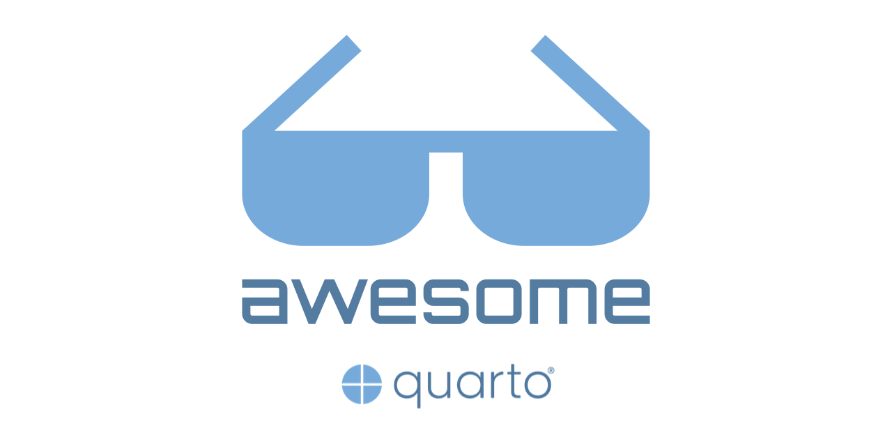

<!--lint disable double-link-->

<!--lint ignore no-dead-urls-->

#  

The most up to date curated list of [Quarto®](https://quarto.org) docs, talks, tools, examples & articles the internet has to offer.

[Quarto®](https://quarto.org) is an open-source scientific and technical publishing system built on [Pandoc]([Pandoc](https://pandoc.org/)).

---

Contributions of any kind are welcome, just follow the [guidelines](.github/CONTRIBUTING.md) by either:

- Filling a [suggestion issue](https://github.com/mcanouil/awesome-quarto/issues/new?assignees=mcanouil&labels=&template=suggestion.yml) (easier).
- Opening a [pull request](https://github.com/mcanouil/awesome-quarto/compare).

---

## Contents

- [Official documentation \& quickstarts](#official-documentation--quickstarts)
- [Tutorials \& workshops](#tutorials--workshops)
- [Blog posts](#blog-posts)
- [Talks and videos](#talks-and-videos)
- [Supported editors](#supported-editors)
- [Libraries/Packages/Scripts](#librariespackagesscripts)
  - [R](#r)
  - [Julia](#julia)
  - [Python](#python)
  - [Editors](#editors)
  - [Miscellaneous](#miscellaneous)
- [Continuous integration / Continuous deployment](#continuous-integration--continuous-deployment)
- [Extensions](#extensions)
- [Real-life examples](#real-life-examples)
  - [Presentations formats](#presentations-formats)
  - [Websites formats](#websites-formats)
  - [Book formats](#book-formats)
  - [Other formats](#other-formats)
- [Follow](#follow)
  - [Official](#official)
  - [Community](#community)

## Official documentation & quickstarts

- [Documentation: Quarto documentation](https://quarto.org/) - Official Quarto Documentation.
- [GitHub: Quarto GitHub repository](https://github.com/quarto-dev) - Official Quarto GitHub repository.
- [Tutorial: Hello, Quarto](https://quarto.org/docs/get-started/hello/) - Official "Hello, Quarto" tutorial.
- [Tutorial: Computations](https://quarto.org/docs/get-started/computations/) - Official "Computations" tutorial.
- [Tutorial: Authoring](https://quarto.org/docs/get-started/authoring/) - Official "Authoring" tutorial.
- [Service: Quarto Pub](https://quartopub.com/) - Create documents, websites, presentations, books, and blogs in Quarto, then securely publish them to the web with the Quarto CLI, the easiest way to publish and share on the web.

## Tutorials & workshops

- [Tutorial: The ultimate guide to starting a Quarto blog](https://albert-rapp.de/posts/13_quarto_blog_writing_guide/13_quarto_blog_writing_guide.html) - An in-depth guide on how to start blogging with Quarto.
- [Tutorial: Creating a blog with Quarto in 10 steps](https://beamilz.com/posts/2022-06-05-creating-a-blog-with-quarto/en/) - A blog post introducing a new Quarto blog and the steps to create your own blog with Quarto.
- [Tutorial: Making shareable docs with Quarto](https://openscapes.github.io/quarto-website-tutorial/) - A tutorial to make website with Quarto.
- [Workshop: From R Markdown to Quarto](https://rstudio-conf-2022.github.io/rmd-to-quarto/) - A workshop for those who want to take their R Markdown skills and expertise and apply them in Quarto, the next generation of R Markdown.
- [Workshop: Getting started with Quarto](https://rstudio-conf-2022.github.io/get-started-quarto/) - "Get started with Quarto" workshop materials for rstudio::conf(2022).
- [Workshop: Quarto, a library to run them all?](https://warwickcim.github.io/quarto-workshop/slides/slides.html) - Workshop at [RSECon'22](https://rsecon2022.society-rse.org/), led by Carlos Cámara, James Tripp and Cagatay Turkay (materials: <https://github.com/WarwickCIM/quarto-workshop>).
- [Tutorial: Creating your personal website using Quarto](https://ucsb-meds.github.io/creating-quarto-websites/) - A step-by-step guide for setting up a personal website using Quarto by Samantha Csik.
- [Tutorial: Customizing Quarto Websites - Make your website stand out using SASS & CSS](https://ucsb-meds.github.io/customizing-quarto-websites/) - Slides by Samantha Csik about using SASS and CSS to customise HTML Quarto website (materials: <https://github.com/UCSB-MEDS/customizing-quarto-websites>).
- [Workshop: Quartaki — 6 hour introduction to Quarto](https://drmowinckels.github.io/quartaki/) - Using R and RStudio by [Athanasia Mo Mowinckel](https://github.com/drmowinckels) covering basic markdown, html reports, citation & cross-refs, pdf and journal templates and Reveal.js presentations.
- [Workshop: Mi primer blog con Quarto](https://perezp44.github.io/taller.primer.blog/) - A workshop in Spanish by Pedro J. Pérez to create a blog with Quarto (materials: <https://github.com/perezp44/taller.primer.blog>).
- [Tutorial: Creating Quarto Journal Article Templates](https://christophertkenny.com/posts/2023-07-01-creating-quarto-journal-articles/) - An in-depth blog post detailing the process for converting journal LaTeX templates into Quarto templates.
- [Tutorial: Personal Website using Jupyter Notebook and Quarto](https://adtarie.net/posts/007-quarto-python-tutorial/) - A Python-oriented step-by-step tutorial on how to create a website using Quarto.
- [Tutorial: Publish a Quarto website with Netlify](https://jadeyryan.com/blog/publish-quarto-website/) - A comprehensive blog post walking through how to create a Quarto website, connect it to GitHub, deploy & publish it with Netlify by Jadey Ryan.
- [Workshop: Parameterized Reports with Quarto](https://jadeyryan.quarto.pub/rladies-dc-quarto-params/) - A 2-hour code-along workshop to learn parameterized reporting with `quarto` and `purrr` to generate multiple format outputs (materials: <https://github.com/jadeynryan/parameterized-quarto-workshop>).
- [Tutorials: Quarto Visual Editor and RStudio](https://youtube.com/playlist?list=PLEzw67WWDg80-fT1hq2IZf7D62tRmKy8f&si=ECVfFIH1bg6_JfjS) - A YouTube playlist of short videos tutorials for beginners to work with Quarto Visual Editor and RStudio by Andy Field.
- [Quarto for amsmath LaTeX users](https://nmfs-opensci.github.io/quarto-amsmath) - Notes focused on addressing issues related to using amsmath LaTeX for numbered equations and fancy math in Quarto books, specifically for HTML and PDF rendering.
- [Tutorial: A step-by-step guide to parameterized reporting in R using Quarto](https://rfortherestofus.com/2024/06/parameterized-reporting-quarto) - A walkthrough of how to use parameterized reporting with Quarto with videos.

## Blog posts

- [We don't talk about Quarto](https://www.apreshill.com/blog/2022-04-we-dont-talk-about-quarto/) - A blog post introducing to Quarto publishing software by Alison Presmanes Hill.
- [Quarto tip a day](https://mine-cetinkaya-rundel.github.io/quarto-tip-a-day/) - A website made with Quarto highlighting a tip for Quarto every day as a blog post.
- [Announcing Quarto, a new scientific and technical publishing system](https://www.rstudio.com/blog/announcing-quarto-a-new-scientific-and-technical-publishing-system/) - Blog post by J.J. Allaire announcing the launch of Quarto, a new open-source scientific and technical publishing system.
- [Interactive Molecular Content](https://www.valencekjell.com/posts/2022-08-13-interactive/) - A blog post showing how to embed interactive content (*i.e.*, molecular visualisation) in webpages with Quarto using Bokeh, 3DMol.js and NGL.
- [Slidecraft 101: Colors and Fonts](https://www.emilhvitfeldt.com/post/slidecraft-colors-fonts/) - A blog post about "The art of putting together slides that are functional and aesthetically pleasing" using Quarto presentation format by Emil Hvitfeldt.
- [Making Slides in Quarto with Reveal.js](https://meghan.rbind.io/blog/quarto-slides/) - A blog post about making slides in Quarto with Reveal.js and how to use emojis or customise the slides by Meghan Hall.
- [A beginner's guide to using Observable JavaScript, R, and Python with Quarto](https://www.infoworld.com/article/3674789/a-beginners-guide-to-using-observable-javascript-r-and-python-with-quarto.html) - This article shows you how to set up a Quarto document to use Observable JavaScript, including how to pass data from R or Python to an Observable code chunk.
- [Six Productivity Hacks for Quarto](https://www.rstudio.com/blog/6-productivity-hacks-for-quarto/) - A blog post showing six tips from the re-use content across documents, the insertion of Pandoc divs and spans to continuous deployment with GitHub Actions.
- [How to add some personality to your Quarto Blog](https://www.ddanieltan.com/posts/blogtips/) - A blog post sharing some of the added features and tweaks users can make on top of the standard blog templates to inject some personality into their blog.
- [Use R to Generate a Quarto Blogpost](https://themockup.blog/posts/2022-11-08-use-r-to-generate-a-quarto-blogpost/) - A blog post about using R to generate Quarto blog post by Tom Mock.
- [Adding Subscriptions to a Quarto Site](https://forbo7.github.io/forblog/posts/7_blog_subscriptions.html) - A blog post about how to add a subscription form to your Quarto blog.
- [I'm an R user: Quarto or R Markdown?](https://www.jumpingrivers.com/blog/quarto-rmarkdown-comparison/) - A blog post comparing Quarto and R Markdown from an R user perspective by [Jumping Rivers](https://www.jumpingrivers.com/).
- [Quarto for the Python User](https://www.jumpingrivers.com/blog/quarto-for-python-users/) - A blog post introducing Quarto to Python user for creating reports.
- [How to publish your Quarto document/book/website as a Docker container?](https://mickael.canouil.fr/posts/2023-05-07-quarto-docker/) - A blog post describing how to publish your Quarto document/book/website as a Docker container by Mickaël Canouil.
- [Making Pretty PDFs with Quarto](https://nrennie.rbind.io/blog/making-pretty-pdf-quarto/) - A blog post showing how to customise the styling of PDF documents, and save the styling into a Quarto extension to make it easier to reuse and share.
- [How to self-publish a technical book on Leanpub and Amazon using Quarto](https://www.brodrigues.co/blog/2023-06-29-book_quarto/) - This blog post explains which settings to use to compile an Epub for Leanpub and a print-ready PDF for Amazon's self-publishing service (KDP).
- [Hello Quarto: Porting my Website from Hugo Apéro](https://silviacanelon.com/blog/2023-09-29-hello-quarto/) - A blog post detailing a user's experience of porting a blogdown Hugo Apéro site to Quarto, with content including design ideas, CSS tips, HTML partials, setting up redirects, and others.
- [Seven Tips for Creating Quarto Reveal.js Presentations](https://remlapmot.github.io/post/2025/quarto-revealjs-tips/) - A blog post showing few tips on how to customise Reveal.js slides with R/knitr, HTML/CSS, and Quarto native options.

## Talks and videos

- [Reproducible authoring with Quarto](https://www.youtube.com/watch?v=6p4vOKS6Xls) - 2022 Toronto Workshop on Reproducibility with Mine Çetinkaya-Rundel (slides: <https://mine-cetinkaya-rundel.github.io/2022-repro-toronto/>).
- [Reproducible Publications with Julia and Quarto](https://www.youtube.com/watch?v=Y1uKNO32H_I) - JuliaCon 2022 with J.J. Allaire (slides: <https://jjallaire.github.io/quarto-juliacon-2022>).
- [A Conversation about Quarto](https://www.youtube.com/watch?v=azVAl343CIU) - [Openscapes](https://www.openscapes.org/) Community Talk: Hello Quarto!
- [Tutorial: How to style your Quarto blog without knowing a lot of HTML/CSS](https://www.youtube.com/watch?v=ErRX8plZpQE) - This is a video tutorial on styling your Quarto blog even if you lack a strong foundation of HTML/CSS.
- [Workshop: Welcome to Quarto 2-hour Workshop](https://www.youtube.com/watch?v=yvi5uXQMvu4) - RStudio Meetup: Welcome to Quarto 2-hour Workshop by Tom Mock (slides: <https://jthomasmock.github.io/quarto-2hr-webinar/>).
- [Quarto for the Curious](https://www.rstudio.com/conference/2022/talks/quarto-for-rmarkdown-users/) - A Quarto overview given by Tom Mock at RStudio::conf(2022) (materials: <https://thomasmock.quarto.pub/quarto-curious/>).
- [Hello Quarto: Share • Collaborate • Teach • Reimagine](https://www.rstudio.com/conference/2022/keynotes/collaborate-with-quarto/) - Keynote by Mine Çetinkaya-Rundel & Julia Stewart Lowndes highlighting how they leverage Quarto in open-science at RStudio::conf(2022) (materials: <https://github.com/mine-cetinkaya-rundel/hello-quarto>).
- [Websites & Books & Blogs, oh my! Creating Rich Content with Quarto](https://www.rstudio.com/conference/2022/talks/sessions/quarto-deep-dive/websites-books-blogs-quarto/) - Talk by Devin Pastoor at RStudio::conf(2022) showing some of the formats available in Quarto and how it is easy to focus on contents while Quarto takes care of the rest.
- [Literate Programming With Jupyter Notebooks and Quarto](https://www.rstudio.com/conference/2022/talks/literate-programming-quarto/) - Talk by Hamel Husain at RStudio::conf(2022) describing the integration between [Nbdev](https://github.com/fastai/nbdev) and Quarto (materials: <https://github.com/fastai/nbdev-demo>).
- [These are a few of my favorite things](https://www.rstudio.com/conference/2022/talks/my-favorite-things-quarto-presentations/) - Talk by Tracy Teal at RStudio::conf(2022) highlighting some of the features of Quarto presentation, such as multiple columns, speaker notes and mode, transitions, *etc.*
- [Building a Blog with Quarto](https://www.youtube.com/watch?v=CVcvXfRyfE0) - RStudio Meetup: Building a Blog with Quarto by Isabella Velásquez (materials: <https://ivelasq.quarto.pub/building-a-blog-with-quarto/>).
- [Beautiful Reports and Presentations with Quarto](https://www.youtube.com/watch?v=hbf7Ai3jnxY) - RStudio Meetup: Beautiful Reports and Presentations with Quarto by Tom Mock (materials: <https://github.com/jthomasmock/quarto-reporting>).
- [Introduction to Quarto](https://www.youtube.com/watch?v=y6_xMIBKuP4) - R-Ladies St. Louis: Introduction to Quarto by Isabella Velásquez (materials: <https://github.com/ivelasq/2022-10-27_intro-to-quarto>).
- [Quarto YouTube Playlist](https://www.youtube.com/playlist?list=PLDqZV53PcnYxnBYuEdSBxnOwdKLGaoKGg) - A YouTube playlist of videos about Quarto and Pandoc by Eli Holmes.
- [Create your Data Science Portfolio with Quarto](https://www.youtube.com/watch?v=xtSFXtDf4cM) - In this video by Deepsha Menghani, learn how you can easily create a Data Science Portfolio website and deploy it instantly with the help of Quarto (materials: <https://deepshamenghani.quarto.pub/portfolio-with-quarto-workshop/#/title-slide>).
- [A Coffee with Quarto and Neovim](https://youtube.com/playlist?list=PLabWm-zCaD1axcMGvf7wFxJz8FZmyHSJ7) - A YouTube playlist showing you how to use Quarto in Neovim by [Jannik Buhr](https://jmbuhr.de/).
- [How to style your Quarto blog without knowing a lot of HTML/CSS?](https://www.youtube.com/watch?v=ErRX8plZpQE) - This is a video tutorial on styling your Quarto blog even if you lack a strong foundation of HTML/CSS by Albert Rapp.
- [Quarto for Academics](https://www.youtube.com/watch?v=EbAAmrB0luA) - This video highlights some of Quarto's features that are especially useful for academics, as educators and as researchers by Mine Çetinkaya-Rundel.
- [Quarto Dashboards](https://www.youtube.com/watch?v=_VGJIPRGTy4) - This video highlights the new dashboard feature arriving in Quarto 1.4 by Charles Teague.
- [Parameterized Quarto reports improve understanding of soil health](https://www.youtube.com/watch?v=lbE5uOqfT70) - posit::conf(2023) talk by Jadey Ryan provides an example workflow of creating parameterized reports with HTML and MS Word outputs (materials: <https://jadeynryan.github.io/2023_posit-parameterized-quarto/>).

## Supported editors

- [Emacs](https://github.com/quarto-dev/quarto-emacs) - [Emacs](https://www.gnu.org/software/emacs/) mode for Quarto.
- [Neovim](https://github.com/quarto-dev/quarto-nvim) - [Neovim](https://neovim.io/) tools to work with Quarto.
- [Sublime Text](https://github.com/quarto-dev/quarto-sublime) - [Sublime Text](https://www.sublimetext.com/) plugin to work with Quarto.
- [Vim](https://github.com/quarto-dev/quarto-vim) - [Vim](https://www.vim.org/) plugin to work with Quarto.
- [Visual Studio Code](https://github.com/quarto-dev/quarto) - [Visual Studio Code](https://code.visualstudio.com/) extension for Quarto.
- [Scrivener](https://forum.literatureandlatte.com/t/scrivener-quarto-a-technical-academic-publishing-workflow/129769) - Quarto support to [Scrivener](https://www.literatureandlatte.com/) via Scrivener Template.
- [RStudio](https://posit.co/products/open-source/rstudio/) - RStudio IDE by [Posit PBC](https://posit.co/) natively supports Quarto.
- [Positron](https://positron.posit.co/) - A next-generation extensible, polyglot data science IDE built by Posit PBC (support via [the Visual Studio Code extension for Quarto](https://github.com/quarto-dev/quarto)).

## Libraries/Packages/Scripts

### R

- [R](https://github.com/quarto-dev/quarto-r) - [R](https://www.r-project.org/) interface package to Quarto CLI.
- [quartostamp](https://github.com/matt-dray/quartostamp) - An R package containing an [RStudio Addin](https://rstudio.github.io/rstudioaddins/) to insert some useful divs and classes into your Quarto `revealjs` document.
- [babelquarto](https://docs.ropensci.org/babelquarto/) - R package to help set up, and render, multilingual Quarto books (see also [babeldown](https://docs.ropensci.org/babeldown/articles/quarto.html)).
- [altdoc](https://github.com/etiennebacher/altdoc) - Alternative to pkgdown to document R packages.
- [surveydown](https://surveydown.org/) - A platform for making markdown-based surveys with Quarto, Shiny, and Supabase.

### Julia

- [Julia](https://github.com/quarto-dev/quarto-julia) - [Julia](https://julialang.org/) interface package to Quarto CLI.
- [DocumenterQuarto](https://github.com/cadojo/DocumenterQuarto.jl) - A Julia package to generate documentation for Julia packages using Quarto and Documenter.

### Python

- [Python](https://github.com/quarto-dev/quarto-python) - [Python](https://www.python.org/) interface package to Quarto CLI.
- [quartodoc](https://github.com/machow/quartodoc) - A Python module that lets you quickly generate Python package API reference documentation using Markdown and Quarto.

### Editors

- [RStudio & VSCode snippets](https://gist.github.com/jthomasmock/11acebd4448f171f786e01397df34116) - RStudio & VSCode snippets to ease typesetting with Quarto.
- [Quarto Wizard](https://github.com/mcanouil/quarto-wizard) - A Visual Studio Code extension that assists you in managing Quarto projects, such as installing and updating extensions.
- [Quarto Wingman](https://github.com/ntluong95/quarto-wingman) - A Visual Studio Code extension that provides an interactive code cell configuration, improved Python syntax highlighting, intelligent token recognition, enhanced footnote display, and an inline code runner for R and Python, making it particularly useful for data exploration.

### Miscellaneous

- [ohq2quarto](https://github.com/hrbrmstr/ohq2quarto) - A Rust-based command line utility to turn any [ObservableHQ](https://observablehq.com/) notebook into a Quarto project.
- [Quartize](https://github.com/hrbrmstr/reveal-qmd) - A Chrome extension to transform any [ObservableHQ](https://observablehq.com/) notebook into a list of downloadable `FileAttachment`s and an in-page Quarto source document.
- [matrix BOT](https://github.com/rgomez90/matrix-bot) - A little bot for the [matrix-network](https://matrix.org/) that listens for some Quarto files and returns the PDF into the matrix channel.

## Continuous integration / Continuous deployment

- [Quarto GitHub Actions](https://github.com/quarto-dev/quarto-actions) - Official Quarto GitHub Actions allowing to setup, render, and deploy Quarto projects via GitHub Actions.
- [Quarto Website with GitHub Actions](https://tarleb.com/posts/quarto-with-gh-pages/) - Publish a Quarto website automatically every time it is updated via GitHub Actions.
- [Quarto Devcontainer Feature](https://github.com/rocker-org/devcontainer-features/tree/main/src/quarto-cli) - Add Quarto CLI to your [Development Containers](https://containers.dev/) as a feature.
- [Publish a Quarto project in 6 minutes](https://www.youtube.com/watch?v=arzBRW5XIkg) - A short video tutorial on how to publish a Quarto project to GitHub Pages with GitHub Actions without any local rendering.
- [Publishing to GitHub Pages](https://mickael.canouil.fr/posts/2024-12-30-quarto-github-pages/) - A small guide exploring various methods (manual and automated) to publish Quarto projects to GitHub Pages.

## Extensions

- [Quarto.org Extensions Listing](https://quarto.org/docs/extensions/) - Quarto extensions listing from <https://quarto.org>.
- [Quarto Extensions Listing](https://m.canouil.dev/quarto-extensions/) - A curated collection of extensions offering an interface to browse, search, and filter extensions by categories and keywords, then install them effortlessly with a simple click or command.

## Real-life examples

### Presentations formats

- [Advanced Introduction to R (French)](https://m.canouil.dev/radvanced/) - See slides [here](https://github.com/mcanouil/radvanced).
- [Streamlining with R](https://github.com/meghall06/personal-website/blob/master/static/slides/NEAIR/NEAIR.qmd) - See slides [here](https://meghan.rbind.io/slides/neair/neair.html).
- [An educator's perspective of the tidyverse](https://github.com/mine-cetinkaya-rundel/tidyperspective/blob/main/talks/dagstat-2022.qmd) - See slides [here](https://mine-cetinkaya-rundel.github.io/tidyperspective/talks/dagstat-2022.html).
- [An anthology of experimental designs](https://github.com/emitanaka/talks/tree/master/Toronto2022) - See slides [here](https://emitanaka.org/slides/toronto2022/).
- [The untold story of palmerpenguins](https://github.com/apreshill/palmerpenguins-useR-2022) - See slides [here](https://apreshill.github.io/palmerpenguins-useR-2022/).
- [Outrageously efficient EDA](https://github.com/jthomasmock/arrow-dplyr) - See slides [here](https://jthomasmock.github.io/arrow-dplyr/).
- [Improvements in textrecipes](https://github.com/emilhvitfeldt/talk-useR2022-textrecipes/) - See slides [here](https://emilhvitfeldt.github.io/talk-useR2022-textrecipes/).
- [Quarto: Create Beautiful Documents with R, Python, Julia and Observable (Runapp 2022 talk)](https://github.com/jimjam-slam/talk-runapp-quarto-2022) - See slides [here](https://runapp2022.talks.jamesgoldie.dev/).
- [Iframes Gallery](https://github.com/EmilHvitfeldt/quarto-iframe-examples) - A gallery of iframes that could be used in Quarto `revealjs` format.
- [Continental-scale biodiversity data assessment using the Atlas of Living Australia](https://github.com/shandiya/VicBioCon2023) - Slides for éVictorian Biodiversity Conference 2023 (See slides [here](https://shandiya.quarto.pub/vicbiocon2023/)).

### Websites formats

- [quarto.org](https://github.com/quarto-dev/quarto-web) - The Quarto documentation website.
- [rlille.fr](https://github.com/RLille/rlille.fr) - The R Lille (R User Group) website using Quarto.
- [R-Manuals](https://github.com/rstudio/r-manuals) - R Manuals rewritten with Quarto.
- [Quarto tip a day](https://github.com/mine-cetinkaya-rundel/quarto-tip-a-day) - Website/blog highlighting a tip for Quarto every day.
- [Documentation website from Jupyter Notebook](https://github.com/aeturrell/skimpy) - Quarto used to generate a website from a Jupyter notebook containing Python module documentation.
- [Program Evaluation for Public Service (course)](https://github.com/andrewheiss/evalf22.classes.andrewheiss.com) - Website for graduate-level course on program evaluation and causal inference using R, built with Quarto.
- [Bioconductor Community Blog](https://github.com/Bioconductor/biocblog) - A Quarto Blog for Bioconductor community.
- [R for Social Scientists workshop](https://github.com/pittmethods/r4ss) - A Quarto website for a workshop which includes Quarto Reveal JS presentations embedded in it.
- [AffCom Lab Website](https://github.com/jmgirard/affcomlab) - A research lab Quarto Blog/website using custom listing pages for people and publications.
- [Quantum Jitter](https://github.com/cgoo4/quantumjitter) - A Quarto website / blog with a custom theme (adapted from flatly / darkly), day / night landing page and a novel 404 page.
- [Andrew Heiss's website](https://github.com/andrewheiss/ath-quarto) - Andrew Heiss's website with custom EJS format, footer, 404 page, (S)CSS, and many more customisations.
- [Ella Kaye's website](https://github.com/EllaKaye/ellakaye.co.uk) - Ella Kaye's website with Bootstrap Grid card home page layout, CSS animation in navigation bar, and light/dark mode.
- [Quering with PRQL](https://github.com/eitsupi/querying-with-prql) - Docusaurus website using computations via `Jupyter` and `knitr` and multiple languages (PRQL, SQL, R, Python, *etc.*).
- [Real World Data Science](https://realworlddatascience.net/) - The Royal Statistical Society website, built with Quarto, features a custom design (based on the Lux Bootswatch theme), with a customised navbar and homepage layout.
- [Silvia Canelón's website](https://silviacanelon.com) - Silvia Canelón's website customized to match the style of the Hugo Apéro blogdown theme.
- [NASCENT-PERU website](https://nascent-peru.github.io/) - A multi-lingual (English/Spanish) website for a scientific research project using the [babelquarto](https://github.com/ropensci-review-tools/babelquarto) package.
- [rainbowR website](https://rainbowr.org) - rainbowR is a community for LGBTQ+ folks who code in R - its website has a rainbow colour theme, custom syntax highlighting for both light and dark modes, and some fun customisations in the navbar.
- [Marten Walk's website](https://martenw.com/) - Academic website of Marten Walk, using a custom theme inspired by the Financial Times, with modern look and many customisations (*i.e.*, custom fonts, custom graphs, etc.).
- [Skimpy documentation](https://aeturrell.github.io/skimpy/) - Skimpy documentation made using `quartodoc`.

### Book formats

- [R for Data Science, 2E](https://github.com/hadley/r4ds/) - "R for Data Science" book second edition (see <https://r4ds.hadley.nz/>).
- [R Packages, 2E](https://github.com/hadley/r-pkgs/) - "R Packages" book second edition (see <https://r-pkgs.org/>).
- [mlr3book](https://github.com/mlr-org/mlr3book/tree/main/book/) - Book on the [`mlr3`](https://mlr3.mlr-org.com/) packages ecosystem (see <https://mlr3book.mlr-org.com/>).
- [Introduction to Data Analysis with R](https://jmbuhr.de/dataintro/) - Introductory course with videos and lecture scripts as a Quarto book format.
- [Python for Data Analysis, 3E](https://github.com/wesm/pydata-book) - "Python for Data Analysis" book third edition (see <https://wesmckinney.com/book/>).

### Other formats

<!--lint disable awesome-list-item-->
<!--lint disable double-link-->

## Follow

<!-- list people worth following on social sites (Twitter, LinkedIn, GitHub, YouTube etc.) -->

### Official

- [@quarto-dev](https://github.com/quarto-dev) - GitHub organisation containing Quarto CLI, IDE plugins/extension, etc.
- [@quarto-ext](https://github.com/quarto-ext) - GitHub organisation containing extensions developed/maintained by Quarto's team.
- [@quarto-journals](https://github.com/quarto-journals) - GitHub organisation containing journals templates developed/maintained by Quarto's team.
- [J.J. Allaire (\@jjallaire)](https://github.com/jjallaire/) - Member of Quarto core team (Twitter: [\@fly_upside_down](https://twitter.com/fly_upside_down)).
- [Christophe Dervieux (\@cderv)](https://github.com/cderv) - Member of Quarto core team (Twitter: [\@chrisderv](https://twitter.com/chrisderv); Mastodon: [\@cderv\@fosstodon.org](https://fosstodon.org/@cderv)).
- [Carlos Scheidegger (\@cscheid)](https://github.com/cscheid) - Member of Quarto core team (Twitter: [\@scheidegger](https://twitter.com/scheidegger); Mastodon: [\@scheidegger\@mastodon.social](https://mastodon.social/@scheidegger)).
- [Charles Teague (\@dragonstyle)](https://github.com/dragonstyle) - Member of Quarto core team (Twitter: [\@dragonstyle](https://twitter.com/dragonstyle)).
- [Yihui Xie (\@yihui)](https://github.com/yihui) - Member of Quarto core team (Twitter: [\@xieyihui](https://twitter.com/xieyihui)).
- [Tom Mock (\@jthomasmock)](https://github.com/jthomasmock) - Customer Enablement & Quarto Product Manager (Twitter: [\@thomas_mock](https://twitter.com/thomas_mock); Mastodon: [\@thomas_mock\@fosstodon.org](https://fosstodon.org/@thomas_mock)).

### Community

- [Mickaël Canouil (\@mcanouil)](https://github.com/mcanouil) - Maintainer of Awesome Quarto list (Twitter: [\@MickaelCanouil](https://twitter.com/MickaelCanouil); Mastodon: [\@MickaelCanouil\@fosstodon.org](https://fosstodon.org/@MickaelCanouil)).

*Who else should we be following!?*

## Contributing

Thanks goes to these [contributors](https://github.com/mcanouil/awesome-quarto/graphs/contributors)!
